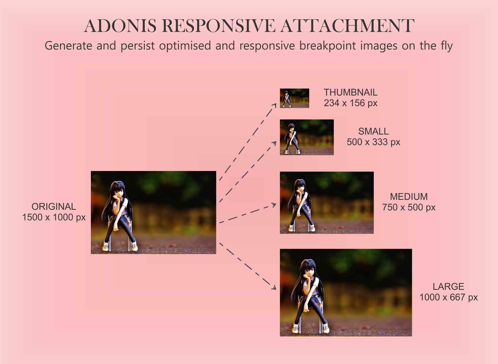

# Adonis Responsive Attachment

<div align="center">
  
</div>

---


[](https://github.com/ndianabasi/adonis-responsive-attachment/actions/workflows/test.yml)

The Adonis Responsive Attachment package converts any column on your Lucid model to an image attachment data type while generating and persisting optimised responsive images from the uploaded image including the original image.

Adonis Responsive Attachment generates very detailed metadata of the original file and each responsive image generated from the uploaded file and persist the metadata within the database. It does not require any additional database tables and stores the file metadata as JSON within the same column.

This add-on only accepts image files and is a fork of the [Attachment Lite](https://github.com/adonisjs/attachment-lite) add-on which only persists the original uploaded file plus its metadata.

## Why Use this Add-On?

The ability of your application/website to serve different sizes of the same image across different devices is an important factor for improving the performance of your application/website. If your visitor is accessing your website with a mobile device who screen width is less than 500px, it is performant and data-friendly to serve that device a banner which isn't wider than 500px. On the other hand, if a visitor is accessing your website with a laptop with a minimum screen size of 1400px, it makes sense not to serve that device a banner whose width is less than 1200px so that the image does not appear pixelated.

The Adonis Responsive Attachment add-on provides the ability to generate unlimited number of responsive sizes from an uploaded and utilise the `srcset` and `sizes` attributes to serve and render different sizes of the same image to a visitor based on the size of their screen. You could get familiar with this concept by studying the [Responsive Images topic on MDN](https://developer.mozilla.org/en-US/docs/Learn/HTML/Multimedia_and_embedding/Responsive_images).

## Use Case for this Add-On

Let us assume you are developing a blog. On the article page, you need to upload a cover image. You also need to generate responsive sizes of the uploaded cover image so that you can serve different sizes to different devices based on their screen sizes. This add-on will optimise and persist the original cover image saving you up to 50% reduction is the file size. It will also generate and persist optimised responsive cover images at various breakpoints which you can customise. Additionally, for the original and responsive cover images, the add-on will generate detailed JSON metadata of the images and persist the metadata as the value for the column within the database. 

On the frontend of your blog, you can use the `srcset` attribute of the `img` element to define and serve the different cover image sizes. You can also use the `picture` wrapper element with the `source` element to define and serve the responsive cover images.

## Features

- Turn any column in your database to an image attachment data type.
- No additional database tables are required. The file metadata is stored as JSON within the same column.
- Automatically removes the old images (original and generated responsive images) from the disk when a new image is assigned to the model.
- Handles failure cases gracefully. No images will be stored if the model fails to persist.
- Similarly, no old images are removed if the model fails to persist during an update or the deletion fails.
- Provides detailed properties of the original and generated images including: `name`, `width`, `height`, `size`, `format`, `mimetype`, `hash`, `extname`, and `url`.
- Can auto-rotate images during the optimisation process.
- Allows you to customise the breakpoints for generating the responsive images
- Allows you to disable generation of responsive images.
- Allows you to disable optimisation of images.
- Converts images from one format to another. The following formats are supported: `jpeg`, `png`, `webp`, `tiff`, and `avif`.

## Pre-requisites

The `attachment-lite` package requires `@adonisjs/lucid >= v16.3.1` and `@adonisjs/core >= 5.3.4`.

It relies on [AdonisJS drive](https://docs.adonisjs.com/guides/drive) for writing files on the disk.

It also relies heavily on the [Sharp image manipulation library](https://sharp.pixelplumbing.com/) for performing image optimisations and generation of responsive images.

## Setup

Install the package from the npm registry as follows.

```bash
yarn add adonis-responsive-attachment
```

Next, configure the package by running the following ace command.

```bash
node ace configure adonis-responsive-attachment
```

## Usage

The first step is to import the `responsiveAttachment` decorator and the `ResponsiveAttachmentContract` interface from the package.

> Make sure NOT to use the `@column` decorator when using the `@responsiveAttachment` decorator.

```ts
import { BaseModel } from '@ioc:Adonis/Lucid/Orm'
import {
  responsiveAttachment,
  ResponsiveAttachmentContract
} from '@ioc:Adonis/Addons/ResponsiveAttachment'

class Post extends BaseModel {
  @responsiveAttachment()
  public coverImage: ResponsiveAttachmentContract
}
```

Now you can create an attachment from the uploaded image as follows.

```ts
import { Attachment } from '@ioc:Adonis/Addons/ResponsiveAttachment'

class PostsController {
  public store({ request }: HttpContextContract) {
    const coverImage = request.file('coverImage')!
    const post = new Post()

    post.coverImage = coverImage ? await Attachment.fromFile(coverImage) : null
    await post.save()
  }
}
```

> You should `await` the operation `Attachment.fromFile(coverImage)` as the uploaded image is being temporarily persisted during the `fromFile` operation.

The `Attachment.fromFile` creates an instance of the Attachment class from the uploaded file. When you persist the model to the database, the `adonis-responsive-attachment` will write the file to the disk.

### Handling updates
You can update the property with a newly uploaded cover image, and the package will take care of removing the old file and storing the new one.

```ts
import { Attachment } from '@ioc:Adonis/Addons/ResponsiveAttachment'

class PostsController {
  public update({ request }: HttpContextContract) {
    const post = await Post.firstOrFail()
    const coverImage = request.file('coverImage')!

    post.coverImage = Attachment.fromFile(coverImage)

    // Old file will be removed from the disk as well.
    await post.save()
  }
}
```

Similarly, assign `null` value to the model property to delete the file without assigning a new file. 

Also, make sure you update the property type on the model to be `null` as well.

```ts
class Post extends BaseModel {
  @attachment()
  public coverImage: ResponsiveAttachmentContract | null
}
```

```ts
const post = await Post.first()
post.coverImage = null

// Removes the file from the disk
await post.save()
```

### Handling deletes
Upon deleting the model instance, all the related attachments will be removed from the disk.

> Do note: For attachment lite to delete files, you will have to use the `modelInstance.delete` method. Using `delete` on the query builder will not work.

```ts
const post = await Post.first()

// Removes any attachments related to this post
await post.delete()
```

## Specifying disk
By default, all files are written/deleted from the default disk. However, you can specify a custom disk at the time of using the `attachment` decorator.

> The `disk` property value is never persisted to the database. It means, if you first define the disk as `s3`, upload a few files and then change the disk value to `gcs`, the package will look for files using the `gcs` disk.

```ts
class Post extends BaseModel {
  @attachment({ disk: 's3' })
  public coverImage: ResponsiveAttachmentContract
}
```

## Specifying subfolder

You can also store files inside the subfolder by defining the `folder` property as follows.

```ts
class Post extends BaseModel {
  @attachment({ folder: 'avatars' })
  public coverImage: ResponsiveAttachmentContract
}
```

## Generating URLs

You can generate a URL for a given attachment using the `getUrl` or `getSignedUrl` methods. They are identical to the [Drive methods](https://docs.adonisjs.com/guides/drive#generating-urls), just that you don't have to specify the file name.

```ts
await post.coverImage.getSignedUrl({ expiresIn: '30mins' })
```

## Generating URLs for the API response

The Drive API methods for generating URLs are asynchronous, whereas serializing a model to JSON is synchronous. Therefore, it is not to create URLs at the time of serializing a model.

```ts
// ❌ Does not work

const users = await Post.all()
users.map((post) => {
  post.coverImage.url = await post.coverImage.getSignedUrl()
  return post
})
```

To address this use case, you can opt for pre-computing URLs

### Pre compute URLs

Enable the `preComputeUrl` flag to pre compute the URLs after SELECT queries. For example:

```ts
class Post extends BaseModel {
  @attachment({ preComputeUrl: true })
  public coverImage: ResponsiveAttachmentContract
}
```

Fetch result

```ts
const users = await Post.all()
users[0].coverImage.url // pre computed already 
```

Find result

```ts
const post = await Post.findOrFail(1)
post.coverImage.url // pre computed already 
```

Pagination result

```ts
const users = await Post.query.paginate(1)
users[0].coverImage.url // pre computed already 
```

The `preComputeUrl` property will generate the URL and set it on the Attachment class instance. Also, a signed URL is generated when the disk is **private**, and a normal URL is generated when the disk is **public**.

### Pre compute on demand

We recommend not enabling the `preComputeUrl` option when you need the URL for just one or two queries and not within the rest of your application.

For those couple of queries, you can manually compute the URLs within the controller. Here's a small helper method that you can drop on the model directly.

```ts
class Post extends BaseModel {
  public static async preComputeUrls(models: Post | Post[]) {
    if (Array.isArray(models)) {
      await Promise.all(models.map((model) => this.preComputeUrls(model)))
      return
    }

    await models.coverImage?.computeUrl()
    await models.coverImage?.computeUrl()
  }
}
```

And now use it as follows.

```
const users = await Post.all()
await Post.preComputeUrls(users)

return users
```

Or for a single post

```ts
const post = await Post.findOrFail(1)
await Post.preComputeUrls(post)

return post
```
 
[github-actions-image]: https://img.shields.io/github/workflow/status/adonisjs/attachment-lite/test?style=for-the-badge
[github-actions-url]: https://github.com/adonisjs/attachment-lite/actions/workflows/test.yml "github-actions"

[npm-image]: https://img.shields.io/npm/v/@adonisjs/attachment-lite.svg?style=for-the-badge&logo=npm
[npm-url]: https://npmjs.org/package/@adonisjs/attachment-lite "npm"

[license-image]: https://img.shields.io/npm/l/@adonisjs/attachment-lite?color=blueviolet&style=for-the-badge
[license-url]: LICENSE.md "license"

[typescript-image]: https://img.shields.io/badge/Typescript-294E80.svg?style=for-the-badge&logo=typescript
[typescript-url]:  "typescript"
